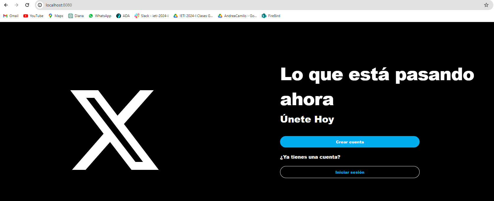
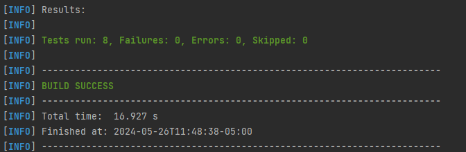
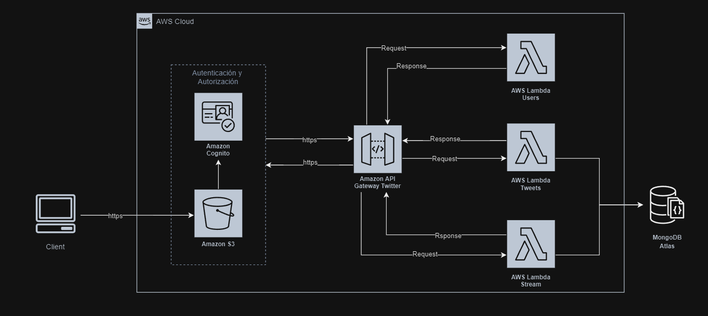
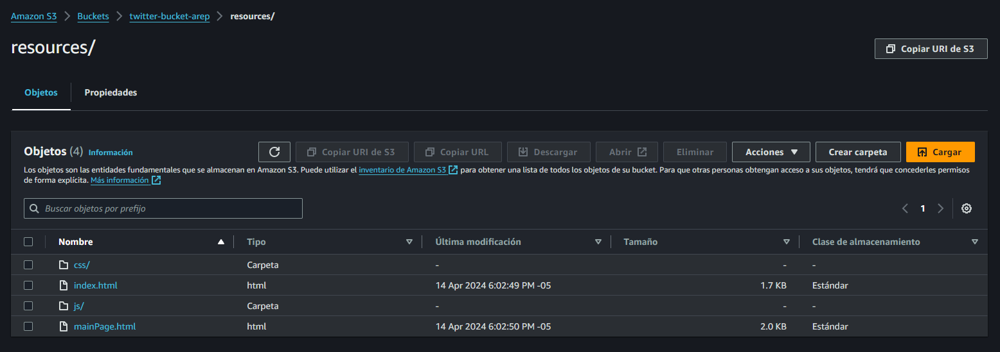
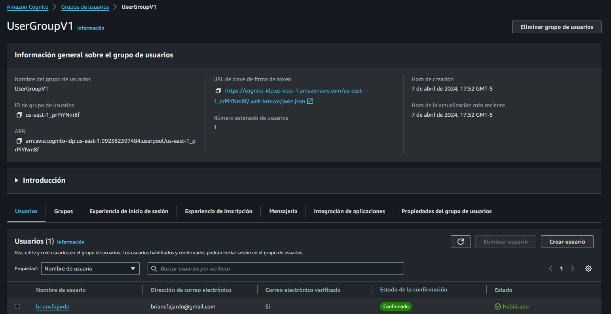
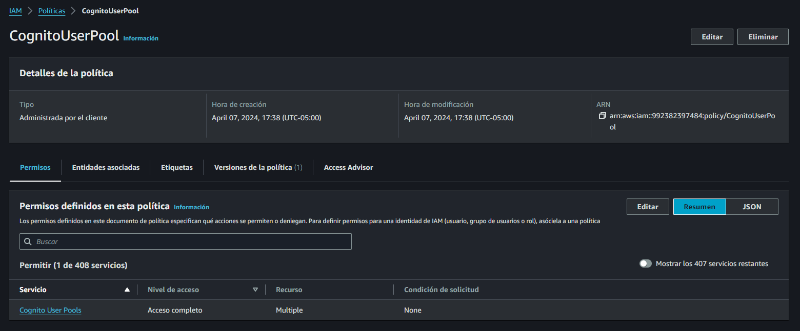
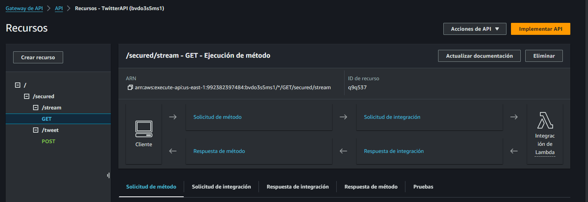
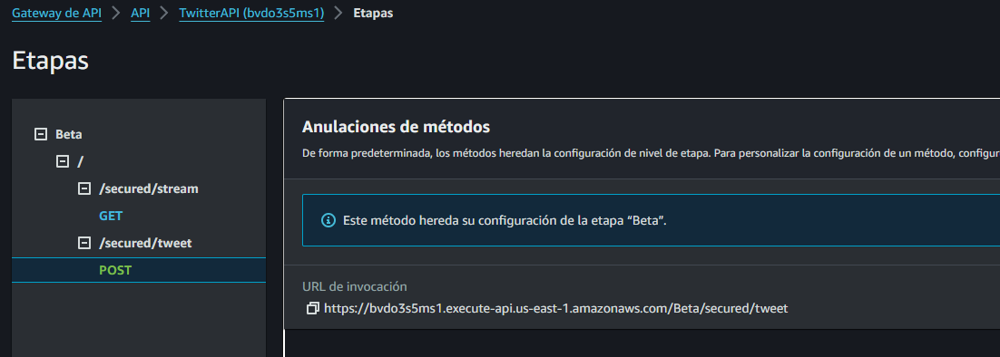

# AREP - Proyecto Final

## Descripción


## Comenzando

Las siguientes instrucciones le permitirán obtener una copia del proyecto en funcionamiento en su máquina local para fines de desarrollo y prueba.

### Requisitos

- [Git](https://www.youtube.com/watch?v=4xqVv2lTo40/) - Control de versiones
- [Maven](https://www.youtube.com/watch?v=1QfiyR_PWxU) - Gestor de dependencias
- [Java 17](https://www.youtube.com/watch?v=BG2OSaxWX4E) - Lenguaje de programación

## Instalación

Para hacer una copia local del proyecto, debemos abrir nuestra terminal, dirigirnos al directorio donde estará el proyecto y usar el siguiente comando

```bash
git clone https://github.com/andreaduranvivas/AREP-Proyecto
```

Nos dirigimos al directorio creado con

```bash
cd AREP-Proyecto
```


## Ejecutando la aplicación localmente


Para ejecutar la aplicación, primero debemos compilar y empaquetar el proyecto con el siguiente comando `mvn clean package`
. Esto nos permitirá limpiar las construcciones previas de otras versiones y luego compilará el proyecto.

Y ejecutamos el siguiente comando para correr el repositorio con quarkus

```bash
mvn quarkus:dev
```

Para visualizar la aplicación, escogemos algún navegador e ingresamos la URL http://localhost:8080/ en la barra de direcciones. Allí encontraremos la primera página de la aplicación,
la cual se basa en un formulario para iniciar sesión o registrarse. Una vez se inicie la sesión, hallaremos un formulario donde se podrían subir y ver las transacciones de los usuarios,
los cuales estarán almacenados en la base de datos.



En la sección de *despliegue* se presenta un video demostrando el funcionamiento de la aplicación, haciendo uso de S3 en AWS.
Para ello usamos AWS Cognito, dos servicios lambda, y un API gateway

## Pruebas

A continuación se detallarán las pruebas unitarias, las cuales se pueden correr con el comando `mvn test`
 y las pruebas de integración se podrán ver en el video en la sección de *despliegue*.:

Deberías ver algo como esto:



### Controlador de Transacciones (`TransactionControllerTest`)

Verifica el correcto procesamiento de solicitudes HTTP para operaciones CRUD sobre transacciones.

- **`testAddTransaction`**: Añade una transacción y verifica el estado de respuesta HTTP.
- **`testGetTransactions`**: Recupera todas las transacciones y valida la respuesta.
- **`testGetTransactionById`**: Busca una transacción por ID y comprueba la precisión de la recuperación.

### Modelo de Transacción (`TransactionTest`)

Confirma que el objeto `Transaction` se inicializa y manipula correctamente sus atributos.

- **`testTransaction`**: Valida la inicialización y acceso a los atributos de un objeto `Transaction`.

### Conexión a MongoDB (`MongoConnectionTest`)

Asegura que la conexión a MongoDB se realiza correctamente y se puede acceder a la colección deseada.

- **`testMongoConnection`**: Verifica la conectividad y acceso a la colección de transacciones.

### Servicio de Transacciones (`TransactionServiceTest`)

Comprueba que el servicio de transacciones interactúa correctamente con la persistencia y devuelve resultados esperados.

- **`testAddTransaction`**: Agrega una transacción y verifica la interacción con la base de datos.
- **`testGetTransactions`**: Recupera todas las transacciones y valida la respuesta.
- **`testGetTransactionById`**: Busca una transacción por ID y comprueba la precisión de la recuperación.


## Documentación

Para visualizar la documentación del proyecto solo debes correr el siguiente comando desde el directorio raíz del proyecto

```bash
mvn javadoc:javadoc
```

Y en la siguiente ruta encontrarás el archivo index.html en donde si lo abres desde el navegador podrás ver toda la documentación

```
./target/site/apidocs
```

## Arquitectura de la aplicación

La arquitectura del prototipo consta de los siguientes componentes:

- **Cliente S3:** Representa el servicio S3 de AWS, con el que dejaremos alojados todos los archivos relacionados con el FrontEnd de nuestra aplicación.

- **AWS Cognito:** Servicio de AWS con el que se hará la autenticación de los usuarios.

- **TransactionService:** Una función lambda encargada de agregar transacciones y retornar si es o no fradulenta.

- **MongoDB:** Es la base de datos donde almacenaremos los tweets.

A continuación se ve el diagrama de la arquitectura.


## Despliegue

Para desplegar la aplicación en AWS, se deben seguir los siguientes pasos:

1. Crear un bucket en S3 para alojar los archivos del FrontEnd de la aplicación.
    


2. Crear un grupo de usuarios en AWS Cognito. Crear un pool de identidades en AWS Cognito.
    


3. Crear una política de IAM para el pool de identidades.
   


4. Crear 2 funciones lambda para los servicios de Transaction y . Debido a ciertas dependencias incompatibles entre quarkus y AWS, creamos otra rama
llamada 'dev' en la que se encuentra el código de las funciones lambda. Así que el jar necesario para crearlas, se crea al haber hecho un `git checkout dev` 
y luego un `mvn clean package`

    


5. Crear un API Gateway para exponer las funciones lambda.
   


6. Exponer el API Gateway en internet.
   

En el siguiente video se muestra el despliegue de la aplicación en AWS, junto con una demostración de su funcionamiento.

[](https://youtu.be/lVfHdSIa3IA)

## Autores

- **Andrea Durán** - [Usuario en GitHub](https://github.com/andreaduranvivas)
- **Camilo Fajardo** - [Usuario en GitHub](https://github.com/briancfajardo)

## Construido con

* [Quarkus](https://quarkus.io/) - Java framework tailored for deployment on Kubernetes
* [Maven](https://maven.apache.org/) - Dependency Management
* [Java](https://www.java.com/es/) - Programming Language
* [JavaScript](https://developer.mozilla.org/en-US/docs/Web/javascript) - Programming Language
* [CSS](https://www.w3.org/Style/CSS/Overview.en.html) - stylesheet Language
* [HTML](https://html.com/) - HyperText Markup Language
* [AWS](https://html.com/) - Amazon Web Services


## Versiones


## Licencia

Este proyecto está bajo la licencia MIT. Ver el archivo [LICENSE](LICENSE) para más detalles.

## Agradecimientos

- Al profesor [Luis Daniel Benavides Navarro](https://ldbn.is.escuelaing.edu.co/)

